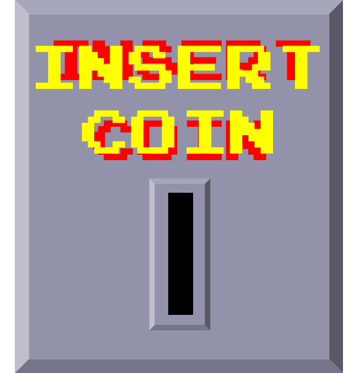

#  내승 인승

B201팀 - _Insert Coin_  
"내가 승리한 것이지 인간이 승리한 것이 아니야 "

## 목차

- [개요](#개요)
- [기능](#기능)
- [기술 스택](#기술-스택)
- [기술 설명](#기술-설명법)

## 개요

> :information_desk_person: man VS :bust_in_silhouette: AI    > _인공지능과 사람이 겨루는게임 플랫폼_

## :bust_in_silhouette: 기능

> - 두뇌의 벽 (1 player, 2 player)
> - 뱀게임

## :information_desk_person: 기술 스택

> Python, Pygame, Numpy, Vue.js, Vuetify, JPA, MariaDB, webRTC, socketIO, node.js, mybatis, Spring boot

## 🙉 기술 설명

> - 뱀게임 (Genetic Algorithm)
>   - 조건
>     1. 초기 세대 난수 설정
>     2. 규칙에 따라 각 유전자별 fitness 수치 산출
>     3. fitness 정리 후 난수를 이용하여 돌연변이 제작
>     4. 과정 반복
> - 두뇌의 벽 (Teachable Machine)
>   - 1 player 
>    - Teachable Machine을 사용하여 이미지 학습 모델 생성
>    - 영상의 사용자 포즈와 포즈 이미지 비교
>   - 2 player
>    - webRTC 와 socketIO, node.js 사용하여 2인 실시간 스트리밍  

## 👪 Member

> 임지민 - 팀장 / FE  / Server  
> 이진용 - FE / Server  
> 김승환 - FE /BE 
> 장한별 - BE / Server    
> 박명수 - AI / FE
